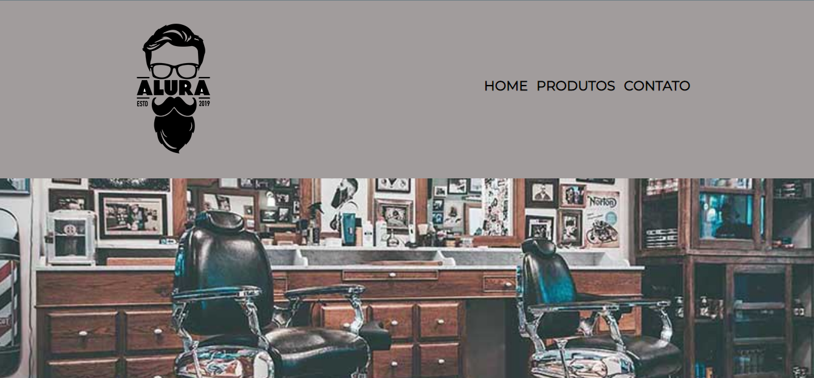
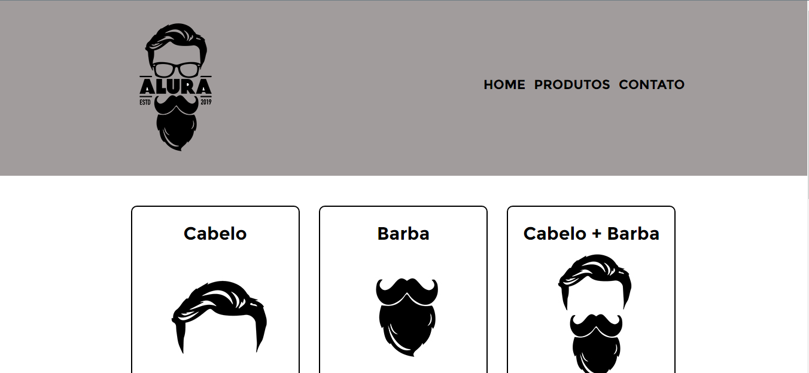
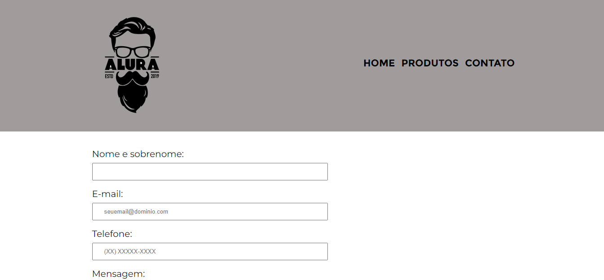

# Curso de Html e CSS Alura

Home Page

Página de produtos

Página de contato

> Sobre o projeto

Projeto construído ao fazer os cursos de HTML e Css da parte 1 a 4

🔗 [Clique aqui para acessar](https://kaiojesus.github.io/Pasta-curso-aluras-front-end/Curso%20Html%20e%20Css/)

## 💻 Tecnologias
- HTML
- CSS
- Git e GitHub

## 📝 Aprendizado

Tive um enorme aprendizado com novos comandos (para mim) no Css. Para a melhor absorção, resolvi comentar com explicações todas essas tags que seriam novas para mim, além de reforçar algo que já sei.

## ✉ Contato

kaiojesus@gmail.com
[LinkedIn](https://www.linkedin.com/in/kaio-jesus/)